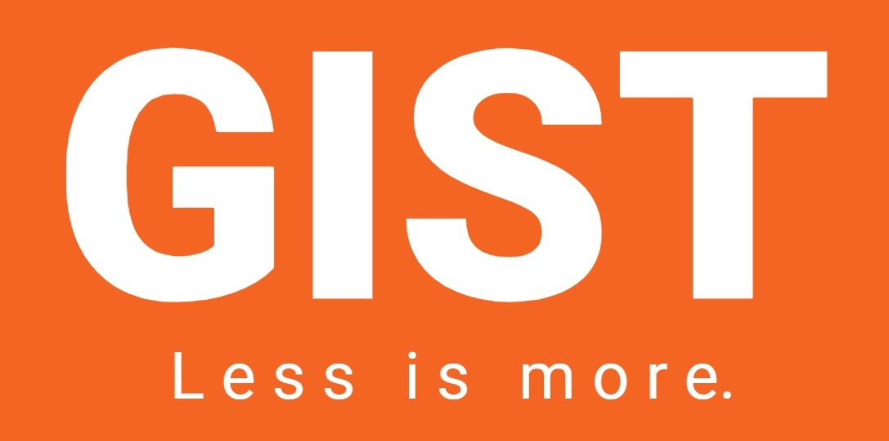

# Gist

    
     Gist: Less is more | A text summarizer

---

## Table of Contents

-   [Motivation](#Motivation)
-   [Installation](#Installation)
-   [Usage](#Usage)
    -   [Project Demo](#Demo)
-   [Contributing](#Contributing)
-   [License](#License)

## Motivation

Our project focuses on creating an accurate text summarizer for news articles. We developed an API that uses various NLP models to acquire a summary of an entire news article. While the API can be potentially used for various other cases including, Movie and book summaries, e-commerce product review summaries, and so on.

Our product Gist focuses on a small part of it for newspaper summarization. This is why we have open-sourced our project for it to be used by people as per their requirements and scope. \
The main difference between our summarizer and other summarizers already in the market is that ours is an abstractive type rather than extractive, which means, it focuses on creating and framing it's own summaries rather than just focusing on points which are relevant and copy pasting them in the summary.

Built as part of the NMIT Hacks 2022 (We won second place!).

## Installation

Firstly, clone the repository using,

<pre>
git clone https://github.com/SVijayB/Gist
</pre>

Once you have the source code, create a virtual environment using the following command,
`python3 -m venv venv`

Enter the virtual environment and install dependancies using `pip install -r requirements.txt`.

Your installation is completed and you are all set to use the API.

## Usage

To launch the file, use the following command, `python3 main.py` in the project folder.

This should launch the API. Some of the endpoints are as follows,

| ID  | Endpoint        | Example                             | Details                                        |
| --- | --------------- | ----------------------------------- | ---------------------------------------------- |
| 1   | [/]             | http://127.0.0.1:5000/              | Index.                                         |
| 2   | [api/extract]   | http://127.0.0.1:5000/api/extract   | Extracts text data based on the input provided |
| 3   | [api/summarize] | http://127.0.0.1:5000/api/summarize | GET Summary of the text sent                   |
| 4   | [api/category]  | http://127.0.0.1:5000/api/category  | GET the category to which the article belongs  |

**Note:** It is mandatory to provide the `type` and `link` parameters in the request. \
`type`: 1 - Article URL, 2 - Image. \
`link`: URL of the article or image (Location on your system).

## Contributing

To contribute to Gist, fork the repository, create a new branch and send us a pull request. Make sure you read [CONTRIBUTING.md](https://github.com/SVijayB/Gist/blob/master/.github/CONTRIBUTING.md) before sending us Pull requests.

Also, thanks for contributing to Open-source!

## License

Gist is under The MIT License. Read the [LICENSE](https://github.com/SVijayB/Gist/blob/master/LICENSE) file for more information.

---
