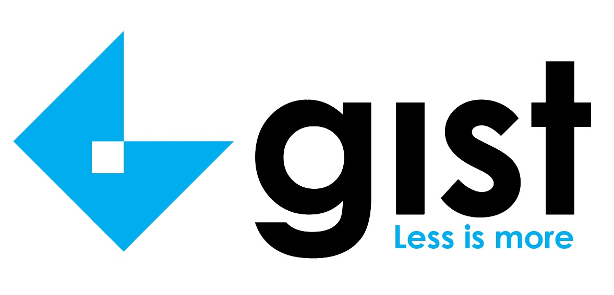

# Gist

    
     Gist: Less is more | A text summarizer

---

    

## Table of Contents

-   [Motivation](#Motivation)
-   [Installation](#Installation)
-   [Usage](#Usage)
-   [Contributing](#Contributing)
-   [License](#License)

## Motivation

Gist started out as a project built as part of NMIT Hacks 2021 and even came runners up! \*wink wink\* \
It was then further developed with improved models, an added front-end and features enhanced.
Gist started as a simple prototype to easily and efficiently summarize any news article into 60 or lesser words for quicker grasp of data, but since then it has come a long way.

Today Gist hosts 3 seperate applications, each with their own unique functionalities, yet derived from the same core. \
Gist Core API summarizes content from text, documents, pdfs, images so you can upload your physical news paper! And even other online news websites. This helps you consume important data much quicker.

Gist at it's heart is an application that acts as a medium where you can read several 60 or lesser word news articles in one place, similar to that of inShorts.

And finally the Gmail Summarizer which was built to quickly get insights on your email data as it becomes harder to keep track of the infinite mails we recieve everyday. And thanks to the devs for making Gist open source, it can be easily accessed and updated by users from around the world and it's features only growing everyday!

## Installation

Firstly, clone the repository using,

<pre>
git clone https://github.com/SVijayB/Gist
</pre>

Once you have the source code, create a virtual environment using the following command,
`python3 -m venv venv`

Enter the virtual environment and install dependancies using `pip install -r requirements.txt`.

Your installation is completed and you are all set to use the API.

For using the front-end, you'll need to make sure you have node installed. Once you have node installed, you can install the dependencies using `npm install` in the `frontend\gist` folder.

## Usage

Once all the dependencies for both the front-end and back-end is completed you need to create a `.env` file in the root directory of the project. \
The .env file should contain the same variables as `.env.example`.
Once that is done, launch the back-end server. To do this, run the following command in the root directory of the project.

<pre>
py main.py
</pre>

Once the back-end is running successfully, you can launch the front-end by running the following command in the `frontend\gist` folder.

<pre>
npm start
</pre>

P.S: You can also find the thesis for the project [here](assets\Thesis.pdf).

## Contributing

To contribute to Gist, fork the repository, create a new branch and send us a pull request. Make sure you read [CONTRIBUTING.md](https://github.com/SVijayB/Gist/blob/master/.github/CONTRIBUTING.md) before sending us Pull requests.

Also, thanks for contributing to Open-source!

## License

Gist is under The MIT License. Read the [LICENSE](https://github.com/SVijayB/Gist/blob/master/LICENSE) file for more information.

---
